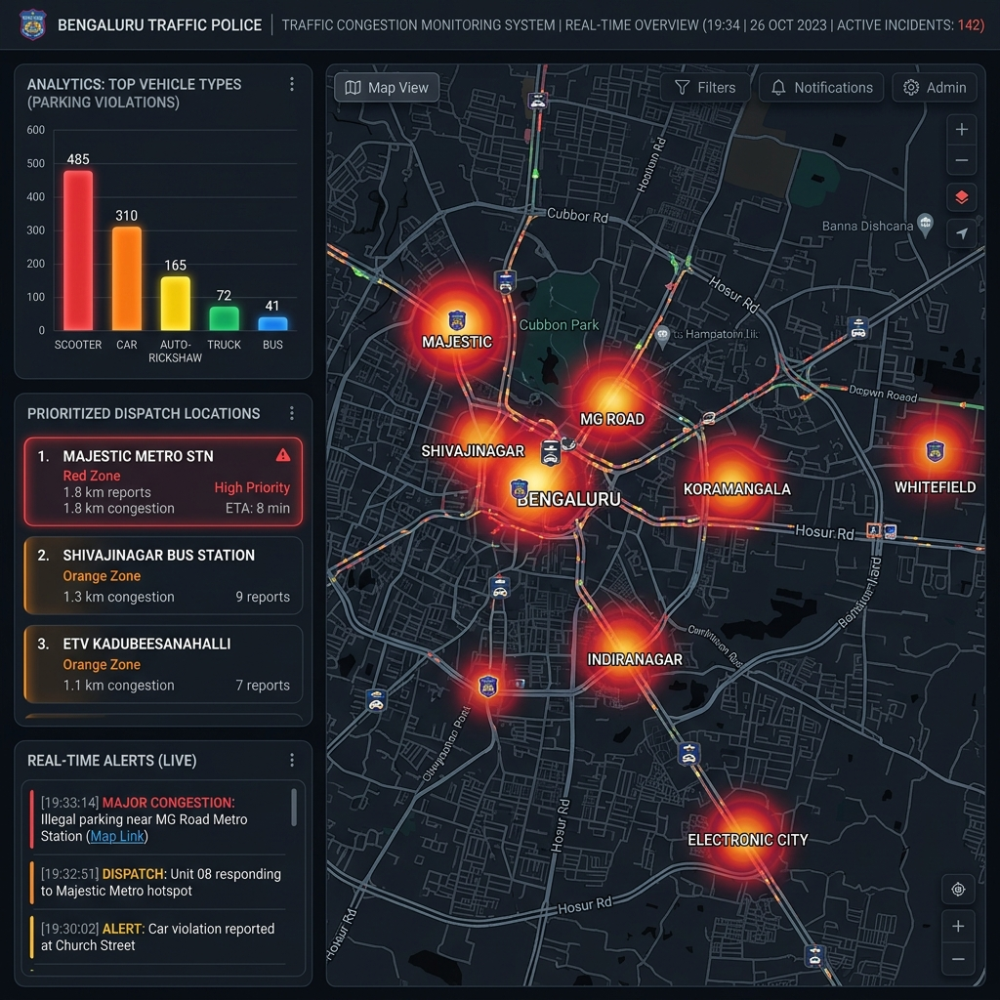

# Proposal: AI-Driven Parking Intelligence & Congestion Mitigation System (ASTraM-Intel)

**Theme**: Poor Visibility on Parking-Induced Congestion  
**Target Organization**: Bengaluru Traffic Police (BTP) & Flipkart Gridlock Hackathon 2.0  
**Authors**: Gridlock Hackathon Team  

---

## 1. Executive Summary
Bengaluru’s carriage ways are increasingly choked by on-street illegal parking and vehicle spillovers, particularly around busy transit nodes, commercial lanes, and tech corridors. Traditional enforcement is reactive, manual, and patrol-dependent.

We propose **ASTraM-Intel (Safe City Intelligent Traffic Analytics)**: a data-driven, AI-enabled parking intelligence framework. Our solution introduces a custom mathematical model—the **Parking Congestion Index (PCI)**—to score parking violations based on their physical vehicle size, time of day, and proximity to critical intersections. By combining this scoring with **DBSCAN Spatial Clustering**, our system automatically groups isolated violations into high-density chokepoint zones, providing traffic police with a prioritized, real-time dispatch dashboard for proactive patrolling and towing.

---

## 2. Operational Challenge: Why It Is Hard Today
1.  **Patrol-Based and Reactive**: Officers manually search roads for violations. By the time an officer arrives, congestion has already propagated upstream.
2.  **No Impact Metric**: A parked scooter in a side-alley is treated with the same priority as a parked truck blocking a major junction. There is no quantification of how a violation affects overall city traffic flow.
3.  **Inefficient Resource Allocation**: BTP tow trucks and patrol wardens are deployed based on intuition rather than historical, data-backed congestion heatmaps.

---

## 3. Core Solution Architecture
ASTraM-Intel runs a multi-layered computer vision and analytics pipeline:

```
[ CCTV Traffic Feeds ] 
         │
         ▼
[ Vehicle Detection & Tracking ] ────► Detects stationary duration, vehicle class, and coordinates
         │
         ▼
[ Parking Congestion Index (PCI) ] ──► Calculates traffic obstruction score in real-time
         │
         ▼
[ DBSCAN Spatial Clustering ] ───────► Groups violations into dynamic chokepoint hotspots
         │
         ▼
[ BTP Smart Dispatch Dashboard ] ────► Directs patrol wardens/tow-trucks proactively
```

1.  **Computer Vision Edge Module**: Leverages existing traffic surveillance cameras. Using a fine-tuned object detection network (e.g., YOLOv8-nano), it identifies vehicles and checks if they remain stationary in restricted zones for $> 60$ seconds.
2.  **PCI Feature Processing**: Scores the violation's impact based on vehicle footprint, temporal peak factors, and junction coordinates.
3.  **Spatial Chokepoint Engine**: Runs DBSCAN clustering on active violations to pinpoint active hotspots within a $100$-meter radius.
4.  **Patrol Dispatch Dashboard**: A web dashboard displaying high-priority zones, prompting dispatch units to clear the most critical chokepoints first.

---

## 4. The Mathematical Model: Parking Congestion Index (PCI)
To prioritize enforcement, we define the **Parking Congestion Index (PCI)** for each violation $i$:

$$PCI_i = W_{\text{vehicle}} \times W_{\text{temporal}} \times W_{\text{spatial}} \times W_{\text{validation}}$$

Where:
*   **Vehicle Footprint Weight ($W_{\text{vehicle}}$)**: Models the physical road width blocked.
    *   *Two-Wheelers (Scooter/Motorcycle)*: $1.0$ (low footprint)
    *   *Cars, SUVs, Vans*: $3.0$ (occupies a full lane)
    *   *Private/BMTC Buses, HGVs, Lorries*: $10.0$ (blocks entire lanes, causing severe gridlock)
*   **Temporal Peak Weight ($W_{\text{temporal}}$)**: Reflects commuting demand.
    *   *Peak Commute Hours (08:00 - 11:00 and 17:00 - 20:00)*: $2.0$
    *   *Off-Peak Hours*: $1.0$
*   **Spatial Junction Proximity Weight ($W_{\text{spatial}}$)**: Captures junction-blocking severity.
    *   *Near Intersection (`junction_name` != 'No Junction')*: $1.5$
    *   *Mid-block*: $1.0$
*   **Validation Confidence Weight ($W_{\text{validation}}$)**: Accounts for false alarms.
    *   *Approved/Verified*: $1.0$
    *   *Pending Review*: $0.8$
    *   *Rejected*: $0.0$ (completely ignored)

---

## 5. Empirical Validation (Insights from the 298k Dataset)
We validated this architecture by analyzing BTP's real-world traffic violation logs containing **298,450 records** (Nov 2023 – Apr 2024). Key empirical findings include:

*   **Parking Domination**: **95.2%** of all recorded traffic violations are parking-related (Wrong Parking: 47.35%, No Parking: 39.90%, Main Road Parking: 6.87%, Footpath Parking: 1.08%). This confirms that parking is the primary driver of city congestion.
*   **Primary Offenders**: Scooters (**31.78%**) and Cars (**29.78%**) are the dominant vehicle categories involved.
*   **Chokepoint Hubs**: DBSCAN clustering identified prominent, recurring hotspots:
    1.  **Tech Corridor Bottlenecks**: New Horizon College Road & Embassy Tech Village (Kadubeesanahalli) show dense clusters with high cumulative PCI.
    2.  **Commercial Clusters**: Kamaraj Road (Shivajinagar) and Majestic (Upparpet jurisdiction, representing 11.55% of city-wide violations).
*   **Sunday Surge**: Sunday has the highest daily violation rate (**15.70%**), driven by shoppers parking near commercial hubs (Safina Plaza, KR Market, Malleshwaram).

---

## 6. Smart Dispatch & Enforcement Dashboard

The dashboard visualizes real-time hotspot clusters, color-coded by enforcement priority (High/Medium/Low) based on the cumulative PCI of active violations. It provides a ranked list of jurisdictions for patrol allocation.

### System Mockup
Below is the UI design for the BTP Smart Patrol Dashboard, showing the heatmap of active hotspots, top offending vehicle types, and the prioritized list of dispatch locations:



---

## 7. Expected Outcomes & Impact
1.  **Targeted Enforcement**: Shifts police work from blind patrolling to data-driven dispatching, reducing patrol mileage.
2.  **Gridlock Prevention**: Prioritizing high-PCI violations (e.g. buses/cars parked near intersections during peak hours) keeps junction boxes clear, directly preventing gridlocks.
3.  **Quantifiable Progress**: BTP can track the reduction in cumulative PCI score across jurisdictions over time, measuring the direct impact of enforcement campaigns on traffic flow.
